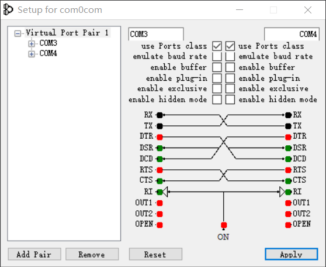
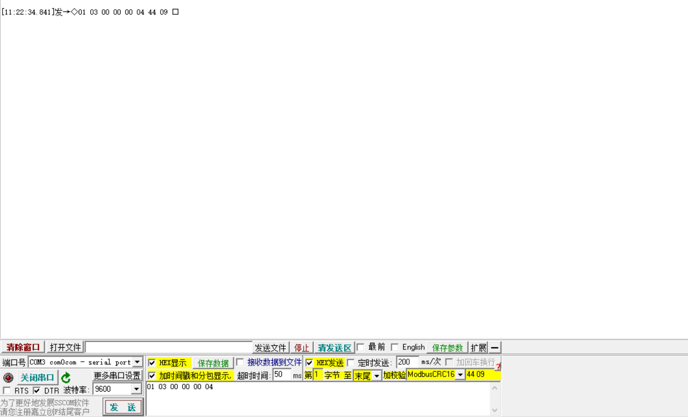
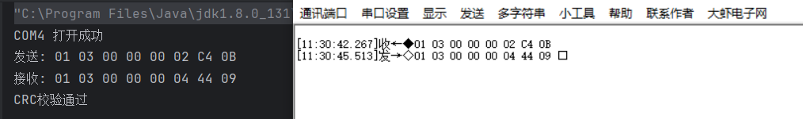

- unpack `com0com-3.0.0.0-i386-and-x64-signed.zip`
- install `com0com.exe`
- start `com0com`
- finaly `Add Pair`

---

- unpack `sscom.rar`
- run `sscom5.13.1.exe`

---

run `comsDevelop/src/main/java/org/jkfm1241/com/Com0comTest.java`
